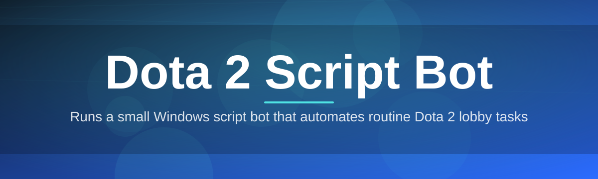
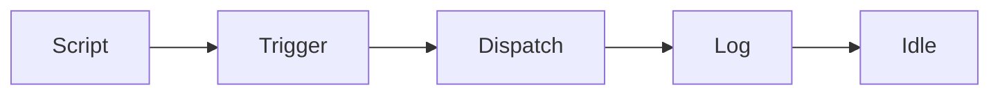

# dota-2-script-controller 🎮🧭

  

*A quiet companion for repetitive Dota 2 routines — built to observe, not to overwhelm.*

  

## 📜 Overview

Every long-running Dota 2 project eventually runs into the same wall: the game rewards mechanical consistency, but humans are not consistent machines. Somewhere between the hundredth courier delivery and the thousandth item-shop click, a small idea took shape among a group of players and tooling enthusiasts — what if the tedious, repeatable motions of a match could be handed off to something patient and precise, while the actual decision-making, the reads, the outplays, stayed entirely human? That question is the origin of **dota-2-script-controller**.

This project began as a weekend utility scribbled together to automate a single annoying task — item shop navigation during laning phase. It grew, slowly and deliberately, into a standalone Windows controller that interprets configurable scripts and translates them into clean, predictable in-game actions. It never tried to become a decision engine or an aim assistant; the philosophy has stayed narrow on purpose. It is a **Dota 2 script bot** in the most literal sense: you write or load a script, the controller executes it, and you keep playing your game.

Today, the tool is used by casual scrimmage groups, coaching circles building repeatable drills, and solo players who simply want their routine actions handled with mechanical precision. It sits outside the game client, watches nothing it shouldn't, and does exactly what its script tells it to — nothing more, nothing hidden.

## 🚀 Get the Controller

> [!NOTE]
> The download button always points to the official landing page. Builds are versioned there, not scattered across random mirrors.

---

## 🧩 What It Actually Does

Rather than a flat feature list, here's the shape of the toolkit — each capability approached from the angle that actually matters when you're mid-match.

- **Script-driven action sequencing** — define a sequence of in-game actions once, replay it identically every time. No drift, no fatigue-induced slip-ups.

- **Timed macro chains** — chain multiple steps with configurable delays so complex routines (shop runs, ability rotations, camera resets) execute in the correct rhythm instead of all at once.

- **Hotkey-bound triggers** — bind any saved script to a keyboard shortcut so activation feels like a natural extension of your existing keybind muscle memory.

- **Profile-based configuration** — save distinct script sets per hero, per role, or per practice drill, and swap between them without rebuilding anything.

- **Lightweight background footprint** — the controller idles quietly with negligible CPU draw, so it never competes with the game for resources during a match.

- **Human-readable script format** — scripts are plain text, editable in any text editor, meaning you can read exactly what a script will do before you ever run it.

- **Visual execution log** — a live panel shows each action as it fires, so you always know precisely what the controller just did.

- **Session-based toggling** — enable or disable the controller per session without touching your saved configurations.

> [!TIP]
> Start with one of the bundled example scripts before writing your own — it's the fastest way to understand the timing model.

---

## 🧭 How To Get Started

1. Visit the landing page using the download button above.

2. Download the standalone Windows package — no installer wizard, no bundled extras.

3. Extract the folder anywhere convenient and launch the executable directly.

4. Load or write a script, bind it to a key, and you're ready for your next match.

> [!IMPORTANT]
> Always download from the official landing page linked in this README. Third-party mirrors are not maintained by this project and may not reflect the current build.

---

## 🖥️ System Requirements

| Requirement | Detail |
|---|---|
| OS | Windows 10 or Windows 11 (64-bit) |
| Dependencies | None — fully standalone executable |
| Disk Space | Under 50 MB |
| Permissions | Standard user, no admin rights required for normal use |
| Game Client | Dota 2, any current client version |

Why no dependency installer?

The controller is compiled as a self-contained binary specifically to avoid the usual dependency dance — no runtime installs, no version conflicts, no extra background services. Download, extract, run.

---

## ⚙️ How It Works

The internal flow is intentionally simple, which is part of why it stays reliable over long sessions.

1. **Script load** — the controller parses a plain-text script into a sequence of discrete actions.

2. **Trigger wait** — it idles until the bound hotkey or scheduled trigger fires.

3. **Action dispatch** — each step is executed in order, respecting the delays defined in the script.

4. **Log capture** — every executed action is written to the on-screen log in real time.

5. **Idle return** — once the sequence completes, the controller returns to a waiting state.

> [!WARNING]
> Scripts with extremely short delays between steps can behave unpredictably on lower-end machines. Test any new script slowly before trusting it in a ranked match.

---

## 🛟 Troubleshooting

**Q: The controller launches but nothing happens when I press my hotkey.**
A: Confirm the script is actually loaded in the active profile, and check that no other application has claimed the same keybind.

**Q: My script runs, but actions fire too fast to register in-game.**
A: Increase the delay values between steps. Dota 2's input handling has a practical minimum spacing for reliable recognition.

**Q: Windows flags the executable on first run.**
A: This is common for unsigned standalone tools. Verify you downloaded from the official landing page, then allow the file through your security prompt.

**Q: Can I run multiple scripts simultaneously?**
A: Not by design — the controller processes one active sequence at a time to keep execution predictable.

**Q: The execution log window disappeared.**
A: It can be toggled back on from the settings panel; it's a visibility setting, not a crash.

**Q: Does this work in every game mode?**
A: It interacts with standard client input, so behavior is consistent across modes, though drill-style scripts are most useful in practice lobbies.

---

## 🎨 UI / UX Details

The interface favors clarity over decoration — a calm control surface rather than a dashboard full of noise.

- **Themes** — Dark and Light modes, toggled from the settings panel.
- **Keyboard shortcuts** — fully rebindable; defaults ship sensible but never forced.
- **Settings persistence** — all preferences save automatically to a local config file.
- **Execution log** — dockable panel, resizable, can be collapsed entirely.

| Shortcut | Action |
|---|---|
| `F5` | Reload active script |
| `F9` | Toggle controller on/off |
| `Ctrl+L` | Show/hide execution log |
| `Ctrl+,` | Open settings |

 

---

## 🤝 Contributing & Community

Contributions are genuinely welcome — this project grew from small user-submitted scripts, and that hasn't changed.

> Open an issue for bugs or script ideas. Pull requests for documentation, example scripts, and quality-of-life improvements are reviewed regularly.

- Discuss ideas in the Issues tab before large changes.
- Keep new scripts documented with a short comment header.
- Follow the existing code style for any core controller contributions.

---

## 📄 License

Released under the [MIT License](LICENSE), 2026.

---

## ⚠️ Disclaimer

This project is an independent tool created by community contributors and is not affiliated with, endorsed by, or associated with Valve Corporation or Dota 2 in any official capacity. Use it thoughtfully, respect the game's terms of service, and understand that any third-party tool carries inherent risk to your account standing. The maintainers provide this software as-is, with no warranty, for personal and educational use.

